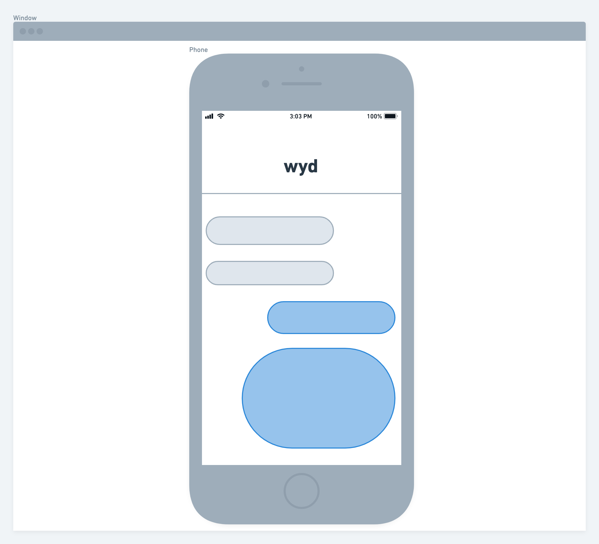

**Title**:
WYD (Working Title)  
**Description**:
This app will randomly generate activities for you to fight boredom. There will be filter functions that will allow the user to narrow down the type of activities along with the number of participants. After the user has narrowed down the search, a random activity will be presented on the page.  
**Wireframes**:
  
**API**:
[Bored API](https://www.boredapi.com/)
Find random activities to fight boredom.  
**MVP**:
Be built with HTML, CSS, and JavaScript.
Use Axios to consume data from an external source, and render that data into the DOM.
Use flexbox (display: flex) and/or CSS grid (display: grid).
Implement responsive design on 3 screen sizes (including desktop) using 2 media queries (tablet and mobile).
Host on Surge.
The app needs to have a filter function on the side of the page that allows the user to select the type of activity and number of participants.
The app will also display the activity along with a related image.  
**Post-MVP**:
If the user selects a group of 3 or more partipants, have a countdown timer and a voting function to decide whether the group will do the activity. If the majority chooses to pass, it will generate a new activity.  
  

| Random       | Description                                                                                            |
| ------------ | ------------------------------------------------------------------------------------------------------ |
| Activity     | Description of the queried activity                                                                    |
| Type         | Type of activity (education, recreational, social, diy, charity, cooking, relaxation, music, busywork) |
| Participants | The number of people that this activity could involve                                                  |
